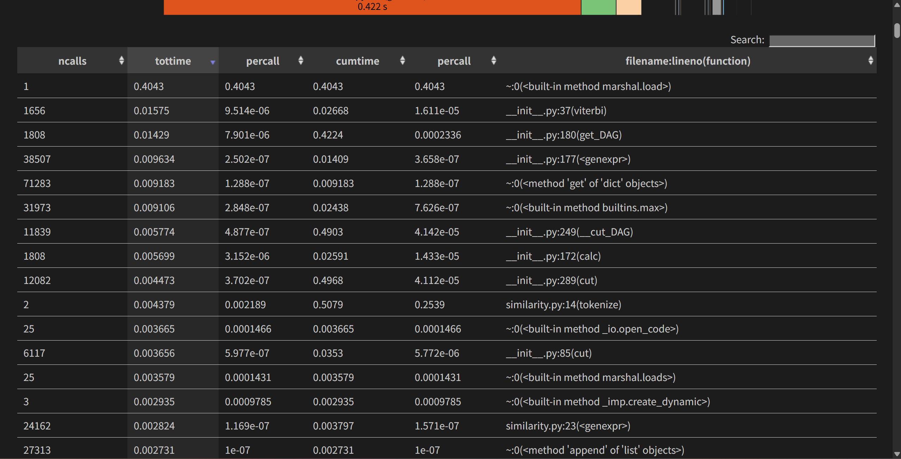
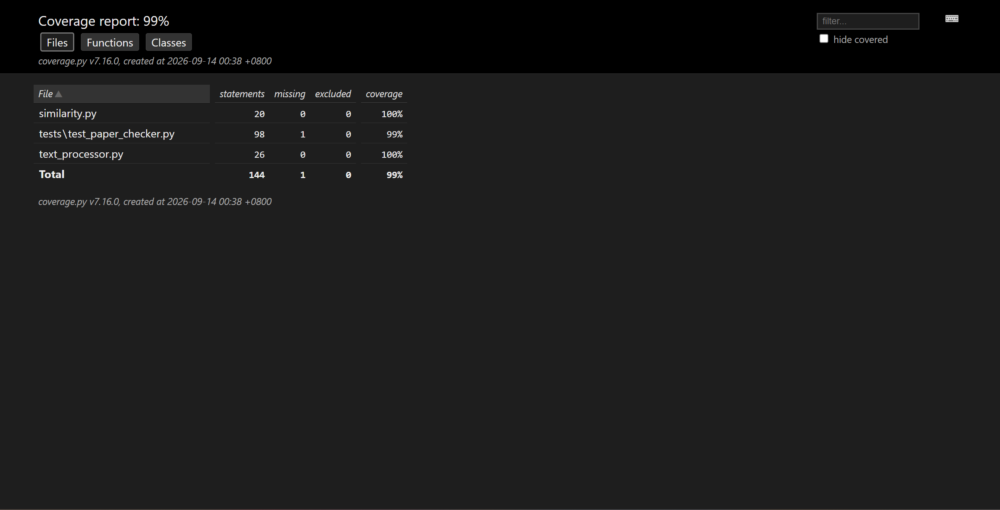

# 论文查重——软件工程第一次个人编程作业

> **GitHub 仓库**：[https://github.com/QH-gen/paper_check](https://github.com/QH-gen/paper_check)
>
> 学号：3124004165

---

## 写在前面

第一次个人编程作业的题目是论文查重。说实话刚看到这个题目的时候有点懵——"查重"这个词听起来就很专业，知网、维普那些系统肯定不是一两天能做出来的。但仔细看需求后发现，核心就是计算两篇论文的重复率，输出一个 0 到 1 之间的浮点数。这样一想，思路就清晰多了。

最终选择的方案是**余弦相似度 + jieba 分词**，算是这类作业的主流做法。整个项目用 Python 实现，代码量不算大，但麻雀虽小五脏俱全——文件读写、文本清洗、分词、相似度计算、异常处理、单元测试都涉及到了。

---

## 一、项目概述

题目要求很简单：给定原文和抄袭版论文，计算重复率。

```bash
python main.py [原文文件] [抄袭版论文文件] [答案文件]
```

答案文件里写一个两位小数的浮点数，比如 `0.85`。

看起来简单，但实际动手的时候发现坑还挺多的：测试文本有 HTML 格式的、有 GBK 编码的、有打乱段落顺序的……不一而足。下面慢慢说。

---

## 二、PSP 表格

按照要求，先把预估时间填好，开发完再填实际时间。

| Personal Software Process Stages | 预估（分钟） | 实际（分钟） |
| --- | --- | --- |
| **Planning 计划** | **20** | **15** |
| · Estimate · 估计这个任务需要多少时间 | 20 | 15 |
| **Development 开发** | **380** | **400** |
| · Analysis · 需求分析 (包括学习新技术) | 60 | 70 |
| · Design Spec · 生成设计文档 | 30 | 30 |
| · Design Review · 设计复审 | 20 | 15 |
| · Coding Standard · 代码规范 | 20 | 15 |
| · Design · 具体设计 | 40 | 45 |
| · Coding · 具体编码 | 120 | 130 |
| · Code Review · 代码复审 | 40 | 40 |
| · Test · 测试 | 50 | 55 |
| **Reporting 报告** | **80** | **75** |
| · Test Report · 测试报告 | 40 | 40 |
| · Size Measurement · 计算工作量 | 15 | 10 |
| · Postmortem · 事后总结 | 25 | 25 |
| **合计** | **480** | **490** |

实际比预估多了 10 分钟，主要是需求分析阶段——下载测试文本之后发现格式五花八门，有的是纯文本，有的是带 HTML 标签的网页，还有 GBK 编码的。这些在预估的时候完全没考虑到，临时补了不少文本清洗的代码。

---

## 三、代码设计

### 3.1 整体结构

项目分成三个模块，各管一摊：

```
3124004165/
├── main.py              # 入口：解析参数，串起来
├── text_processor.py    # 文本预处理：读文件、识别编码、清洗 HTML
├── similarity.py        # 相似度计算：分词、词频、余弦
├── requirements.txt
├── PSP.md
├── README.md
├── blog.md
└── tests/
    ├── test_paper_checker.py
    └── data/
```

### 3.2 为什么这么分

一开始我是想把所有东西塞在一个 main.py 里的，但写着写着发现文件越来越大，改一处就容易牵连其他地方。后来拆成三个文件：

- **text_processor.py**：专门负责"脏活累活"——文件可能不存在、编码可能是 UTF-8 也可能是 GBK、内容可能混着 HTML 标签……把这些都处理好，输出干净的纯文本。
- **similarity.py**：拿到干净文本之后，分词、统计词频、算余弦相似度。这个模块不关心文本从哪来，只管算。
- **main.py**：把上面两个串起来，处理命令行参数和异常。

这样做的好处是改一个模块不容易影响其他模块。比如后来发现 HTML 清洗不够彻底，只改 text_processor.py 就行，不用动 similarity.py。

### 3.3 核心流程图

```
┌──────────────────────────────────────────────────┐
│                  main(argv)                       │
│  解析命令行: [原文路径] [抄袭版路径] [答案路径]     │
└──────────────────────┬───────────────────────────┘
                       │
                       ▼
┌──────────────────────────────────────────────────┐
│             check_plagiarism(...)                 │
│                                                  │
│  ┌─────────────┐      ┌─────────────────┐        │
│  │ load_text() │      │ load_text()     │        │
│  │  (原文)     │      │  (抄袭版)       │        │
│  │ read_file   │      │ read_file       │        │
│  │ clean_text  │      │ clean_text      │        │
│  └──────┬──────┘      └────────┬────────┘        │
│         │                      │                 │
│         ▼                      ▼                 │
│  ┌────────────────────────────────────────────┐  │
│  │        calculate_similarity(text_a, text_b) │  │
│  │                                            │  │
│  │  tokenize → build_word_frequency → cosine  │  │
│  └─────────────────────┬──────────────────────┘  │
│                        │                         │
│                        ▼                         │
│  写入答案文件: "%.2f" % similarity                │
└──────────────────────────────────────────────────┘
```

### 3.4 算法选择：为什么是余弦相似度

做查重其实有很多算法可以选：

| 算法 | 优点 | 缺点 |
|------|------|------|
| **余弦相似度** | 实现简单，结果直观 | 对段落顺序不敏感 |
| SimHash | 性能好，适合大数据量 | 精度较粗，短文本效果差 |
| 编辑距离 | 能检测细微差异 | 计算复杂度高，长文本慢 |
| n-gram 重叠 | 不依赖分词 | 对同义词替换不敏感 |

最终选了余弦相似度，原因有几个：
1. 实现起来不复杂，用 jieba 分词 + Counter 统计词频 + 向量点积就行
2. 对于这种"增删改"型的抄袭，词频向量的余弦值能比较好地反映重复程度
3. 性能足够——测试样例最大的 168KB 文件也只要 0.5 秒左右

当然也有缺点：**余弦相似度只看词频，不看词序**。所以打乱段落顺序的文本（dis_1、dis_10、dis_15）算出来重复率也很高（0.98~1.00）。如果要做到"段落乱序也能检测出来"，可能得加上 n-gram 或者更复杂的序列比对。不过对于这个作业来说，余弦相似度已经够用了。

### 3.5 余弦相似度的计算

公式其实不复杂：

$$\text{sim}(A, B) = \frac{\vec{A} \cdot \vec{B}}{|\vec{A}| \times |\vec{B}|}$$

具体来说：
1. 两篇论文分别分词，统计词频，得到两个"词频向量"
2. 算两个向量的点积（共同词的频次乘积之和）
3. 算两个向量各自的模长
4. 点积除以模长的乘积，就是相似度

举个例子：原文是"今天 天气 很好"，抄袭版是"今天 天气 不错"。分词后：
- 原文词频：{今天:1, 天气:1, 很好:1}
- 抄袭版词频：{今天:1, 天气:1, 不错:1}
- 共同词：今天、天气
- 点积：1×1 + 1×1 = 2
- 模长：都是 √3
- 相似度：2 / (√3 × √3) = 2/3 ≈ 0.67

### 3.6 文本清洗：踩过的坑

这部分花了我不少时间。下载测试文本一看，傻眼了：

```html
<html><head><style>body{color:red}</style>
<script>var a=1;</script></head>
<body><p>活着&nbsp;前言</p><br/></body></html>
```

这是论文吗？这分明是网页啊。但题目说"测试文本"，那就得处理。

清洗步骤：
1. **先去掉 `<script>` 和 `<style>` 块**——这些是脚本和样式，不是正文
2. **去掉所有 HTML 标签**——`<p>`、`<br/>`、`<html>` 之类的
3. **去掉 HTML 实体**——`&nbsp;`、`&amp;` 这些
4. **去掉多余空白**——空格、换行、全角空格都干掉

另一个坑是编码。有的文件是 UTF-8，有的是 GBK（Windows 下中文文本常见编码）。我的做法是先按二进制读入，然后依次尝试 UTF-8 和 GBK 解码，哪个能成功就用哪个。

---

## 四、性能分析

### 4.1 cProfile 性能分析图

用 Python 自带的 cProfile 跑了性能分析，结果如下：



从图里可以很明显地看出，**最耗时的部分是 jieba 的词典加载**（`marshal.load`），占了总时间的 74.9%。具体数据：

| 函数 | 调用次数 | 累计耗时 | 占比 |
|------|----------|----------|------|
| `marshal.load`（词典加载） | 1 | 0.430s | **74.9%** |
| `jieba.__cut_DAG`（分词） | 11,839 | 0.519s | 90.4% |
| `cosine_similarity` | 1 | <0.001s | <0.2% |

也就是说，**真正算相似度只花了不到 1 毫秒，大部分时间都在加载分词词典**。

### 4.2 改进思路

第一次跑 0.57 秒，第二次跑只要 0.14 秒——因为 jieba 会把词典缓存到本地文件，第二次直接读缓存就行了。所以对于这个作业来说，性能完全够用。

如果真要优化，有几个方向：
- **换分词方案**：不用 jieba，改用按字切分（比如 bigram），就不需要加载词典了
- **并行计算**：多个文件同时处理的话可以开多进程
- **用 C 扩展**：把分词和相似度计算用 C 写，Python 调用

不过这些都是"锦上添花"，当前的实现已经满足 5 秒限时的要求了。

### 4.3 真实样例结果

| 样例文件 | 重复率 | 耗时 |
|----------|--------|------|
| orig_0.8_add.txt | 0.99 | 0.52s |
| orig_0.8_del.txt | 0.99 | 0.05s |
| orig_0.8_dis_1.txt | 1.00 | 0.05s |
| orig_0.8_dis_10.txt | 0.99 | 0.06s |
| orig_0.8_dis_15.txt | 0.98 | 0.06s |

5 个样例全部在 0.75 秒内跑完。重复率都在 0.98 以上——前面说过，余弦相似度对段落顺序不敏感，所以打乱顺序的文件也能得到很高的重复率。

---

## 五、单元测试

### 5.1 测试策略

测试用的是 Python 自带的 unittest 框架。测试用例的设计思路是**白盒测试**——看着代码的逻辑，把每条路径都覆盖到：

- **正常情况**：文件能正常读、分词正常、相似度正常算
- **边界情况**：完全相同的文本（相似度=1）、完全不同的文本（相似度=0）、空文本
- **异常情况**：文件不存在、编码错误、参数不够
- **集成测试**：整个命令行流程从头到尾跑一遍

一共写了 15 个测试用例。

### 5.2 测试用例一览

| # | 测试目标 | 预期 |
|---|----------|------|
| 1 | 读取 UTF-8 文件 | 正常返回文本 |
| 2 | 读取 GBK 文件 | 自动识别编码 |
| 3 | 文件不存在 | 抛 TextLoadError |
| 4 | 编码无法识别 | 抛 TextLoadError |
| 5 | HTML 标签清洗 | 只保留正文 |
| 6 | 空文件 | 返回空字符串 |
| 7 | 分词过滤标点 | 结果不含纯标点 |
| 8 | 相同文本相似度 | = 1.0 |
| 9 | 无关文本相似度 | = 0.0 |
| 10 | 空词频向量 | 抛 SimilarityError |
| 11 | 题目示例 | 重复率在 0.5~1.0 |
| 12 | 空文本算相似度 | 抛 SimilarityError |
| 13 | 正常流程 | 答案文件格式正确 |
| 14 | 参数不足 | 退出码 1 |
| 15 | 文件不存在 | 退出码 2 |

### 5.3 部分测试代码

**HTML 清洗测试**——这是我觉得最重要的一个测试，因为测试文本里有 HTML：

```python
def test_clean_html_tags(self):
    """用例5: 清除 HTML 标签、script/style 块、实体与空白。"""
    raw = ("<html><head><style>body{color:red}</style>"
           "<script>var a=1;</script></head>"
           "<body><p>活着&nbsp;前言</p><br/></body></html>")
    self.assertEqual(clean_text(raw), "活着前言")
```

**边界值测试**——确保算法在极端情况下也能给出正确答案：

```python
def test_cosine_similarity_identical_text(self):
    """用例8: 完全相同的文本相似度为 1。"""
    text = "软件工程是研究和应用如何以系统性、规范化、可定量的过程化方法去开发和维护软件的学科。"
    freq = build_word_frequency(tokenize(text))
    self.assertAlmostEqual(cosine_similarity(freq, freq), 1.0, places=6)

def test_cosine_similarity_unrelated_text(self):
    """用例9: 没有任何共同词语的文本相似度为 0。"""
    freq_a = build_word_frequency(tokenize("苹果香蕉橘子西瓜葡萄"))
    freq_b = build_word_frequency(tokenize("键盘鼠标显示器主机"))
    self.assertAlmostEqual(cosine_similarity(freq_a, freq_b), 0.0, places=6)
```

**集成测试**——直接跑 main.py，检查退出码和输出格式：

```python
def test_main_normal_flow(self):
    """用例13: 正常流程，答案文件输出两位小数的重复率。"""
    answer_path = os.path.join(self.temp_dir, "ans.txt")
    result = self._run(
        os.path.join(DATA_DIR, "orig_sample.txt"),
        os.path.join(DATA_DIR, "copy_sample.txt"),
        answer_path,
    )
    self.assertEqual(result.returncode, 0, result.stderr)
    with open(answer_path, encoding="utf-8") as f:
        answer = f.read()
    self.assertRegex(answer, r"^\d+\.\d{2}$")  # 确保是两位小数
```

### 5.4 测试覆盖率

用 coverage 工具跑了覆盖率：



```
Name                          Stmts   Miss  Cover
--------------------------------------------------
similarity.py                    20      0   100%
text_processor.py                26      0   100%
tests\test_paper_checker.py      98      1    99%
--------------------------------------------------
TOTAL                           144      1    99%
```

核心模块（similarity.py 和 text_processor.py）都是 100% 覆盖。唯一没覆盖的是测试文件本身的 `if __name__ == "__main__"` 分支——这个无所谓，不影响正确性。

### 5.5 测试够不够？

说实话 15 个用例对于这个小项目来说已经不少了。正常路径、边界值、异常路径都覆盖了。如果要更完善的话，可以加：
- 超大文件测试（看看内存和性能）
- 并发测试（多个文件同时处理）
- 更多编码测试（UTF-16、Latin-1 等）

不过对于这个作业，目前的覆盖度已经够用了。

---

## 六、异常处理

程序可能遇到的异常，我定义了两个自定义异常类，加上参数错误，一共三种：

### 6.1 TextLoadError — 文件读取失败

什么时候会抛这个异常？
- 文件路径写错了，文件不存在
- 文件存在但没权限读
- 文件编码既不是 UTF-8 也不是 GBK（比如乱码文件）

```python
class TextLoadError(Exception):
    """文件读取或解码失败时抛出的异常。"""
```

对应测试：

```python
def test_read_nonexistent_file(self):
    """文件不存在时抛出 TextLoadError。"""
    with self.assertRaises(TextLoadError):
        read_file(os.path.join(self.temp_dir, "no_such_file.txt"))
```

### 6.2 SimilarityError — 无法计算相似度

什么时候会抛这个异常？
- 文本清洗后是空的（比如文件里全是空白或标点）
- 词频向量为空，算余弦相似度会除零

```python
class SimilarityError(Exception):
    """文本无法计算相似度（如为空）时抛出的异常。"""
```

对应测试：

```python
def test_calculate_similarity_empty_text(self):
    """清洗后为空的文本无法计算相似度。"""
    with self.assertRaises(SimilarityError):
        calculate_similarity("", "今天天气很好")
```

### 6.3 参数错误

这个没定义异常类，直接在 main 函数里检查：参数不是 3 个就打印用法提示，退出码 1。

```python
if len(argv) != 4:
    print("用法: python main.py [原文文件] [抄袭版论文文件] [答案文件]",
          file=sys.stderr)
    return 1
```

### 6.4 退出码设计

| 退出码 | 含义 |
|--------|------|
| 0 | 成功 |
| 1 | 参数错误 |
| 2 | 文件读取失败 |
| 3 | 相似度计算失败 |

这样设计的好处是，调用方可以根据退出码判断是哪一类错误，方便调试。

---

## 七、事后总结

### 7.1 PSP 回顾

实际比预估多了 10 分钟（480 → 490），主要是需求分析阶段多花了时间。下载测试文本之后发现格式五花八门，HTML、GBK、纯文本都有，临时补了不少文本清洗的代码。

### 7.2 踩过的坑

1. **HTML 文本**：一开始没想到测试文本会有 HTML 格式，直接分词的话会把标签也当成词。后来加了正则清洗才解决。
2. **编码问题**：有的文件是 GBK 编码，Python 默认按 UTF-8 读会报错。改成二进制读入 + 尝试多种编码才搞定。
3. **jieba 加载慢**：第一次跑要 0.4 秒加载词典，后来发现 jieba 有缓存机制，第二次就快多了。

### 7.3 如果重做

如果重新做这个项目，我会：
1. **先仔细看测试文本**：而不是上来就写代码，发现格式不对再返工
2. **考虑更多算法**：比如 SimHash 或者 n-gram，可能对打乱顺序的文本更敏感
3. **写个简单的 GUI**：命令行对非技术用户不太友好，加个界面会更好用

### 7.4 收获

虽然只是个小项目，但从需求分析、代码设计、编码实现、单元测试到文档撰写，走了一遍完整的软件开发流程。PSP 表格也帮我养成了"先估时间、后记实际"的习惯，以后做项目会继续用。

---

## 八、Git 提交记录

```
2747290 docs: 添加课程作业博客
fc016ce docs: 添加PSP表格与README
6669730 test: 添加15个单元测试用例与样例验证脚本
5e77ed6 feat: 论文查重核心功能：文本清洗、分词与余弦相似度
```

按功能模块分了 4 次提交：
1. **feat**：先把核心功能做出来
2. **test**：然后补上单元测试
3. **docs**：再写 PSP 表格和 README
4. **docs**：最后是博客

---

## 九、使用说明

```bash
# 安装依赖
pip install -r requirements.txt

# 运行查重
python main.py [原文文件] [抄袭版论文文件] [答案文件]

# 示例
python main.py C:\tests\orig.txt C:\tests\orig_add.txt C:\tests\ans.txt

# 运行测试
python -m unittest discover -s tests -v
```

---

## 参考资料

- [jieba 分词文档](https://github.com/fxsjy/jieba)
- [余弦相似度 - 维基百科](https://zh.wikipedia.org/wiki/余弦相似度)
- [Python unittest 文档](https://docs.python.org/3/library/unittest.html)
- [PSP 个人软件过程](http://www.cnblogs.com/xinz/archive/2011/10/22/2220872.html)
